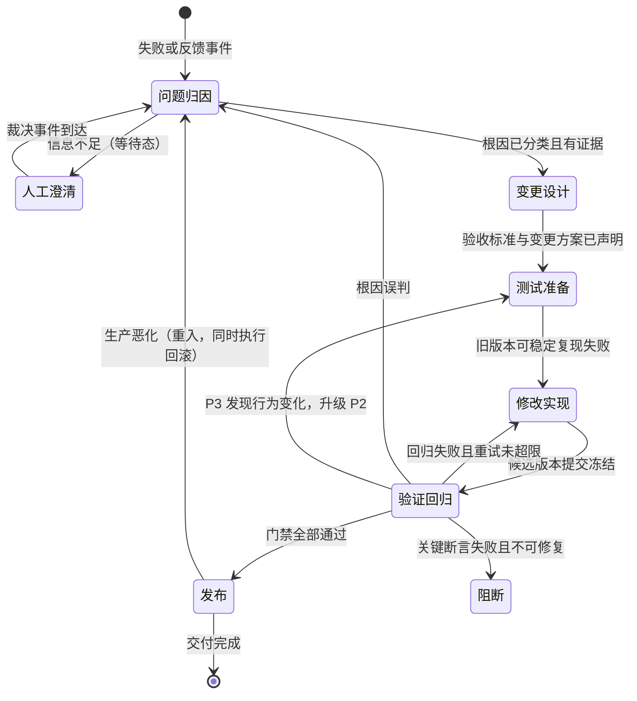

# Agent/Skill 迭代状态机

被迭代的对象（agent、skill、提示词工作流及其脚本、schema、共享组件）统称**工件**。本 skill 把迭代从"根据反馈加一条规则"升级为可执行的状态机：先定位根因，再定义成功，再建 eval 和基线，最小修改，独立验证，带门禁发布。

不适用：从零设计新工件（本 skill 只管已有工件的迭代）；与工件行为无关的一次性杂务。

**纯笔误不开任务**：代码注释、README 措辞这类不影响任何触发、脚本输出或生成内容的改动，直接修改 + commit + changelog 一行即可，不占任务编号。判断标准只有一条：改动会不会出现在工件的输出或行为里——会（哪怕只是页眉格式），就至少是 P3，走下面的裁剪闭环；不会，就不是迭代。

## 启动迭代任务

1. **确定工件与其仓库**。后续所有存储都相对工件仓库：迭代日志 `iterations/{任务编号}/`、eval 集 `evals/`、基线库 `results/`、`CHANGELOG.md`。工件自含全部迭代历史。若工件仓库尚未 git 化，先 `git init`——候选冻结、tag、回滚点都依赖 git。
2. **分配任务编号**。扫描仓库 `iterations/` 下已有任务目录，取最大编号 +1（T-001 格式递增）。任务编号是迭代日志、commit message、changelog 的公共索引。
3. **分级分诊**（进入流程前一次定档，执行中途不得悄悄升级）：

| 级别 | 判定特征 | 流程深度 |
|---|---|---|
| P1 结构性变更 | 改 schema、中间模型、共享组件、校验器、发布门禁 | 全量闭环：完整归因 + eval + 全部回归 + 全部门禁 |
| P2 局部行为变更 | 改单个工件的流程、脚本逻辑、术语或示例 | 裁剪闭环：归因 + 当前失败测试 + 核心回归 + 结构不变量 |
| P3 表述调整 | 改文案、注释、排版，不改任何触发或行为逻辑 | 最小闭环：确认无行为影响 + 当前失败测试 + 门禁 |

P3 若在验证中发现行为变化，必须升级为 P2 并回到测试准备。

**P3 裁剪规则**——文件链保留（中断恢复与状态判定依赖文件存在性），但每份降到最低限度：

- 01-归因问答、02 两份文件各一两行即可；触及清单照写不省——它是 diff 边界，P3 尤其容易被"顺手多改一点"
- 03 只记改前/改后各一条对比命令与基线位置
- 05 可以就是脚本对比输出加一行结论。验证是确定性 diff 时由脚本执行、不 spawn——脚本没有实现者上下文，"非实现者"条件天然满足；涉及语义判断（输出质量、措辞、格式观感）才用 spawn/新会话

4. **前置成熟度检查**。三项任一不满足时，先补齐再进流程——否则守卫无法判定，状态机空转：
   - 当前失败可转化为至少一条可执行断言或 eval
   - 旧版本输出可保存并与新版本对比（基线能力）
   - 关键校验失败时能返回非零状态并被识别

## 状态判定：文件即进度

`iterations/{任务编号}/` 里按编号落盘的文件本身就是进度。会话中断后重入，先查文件确定断点（`python {本skill目录}/scripts/state_check.py <工件仓库路径>` 可自动判定并指出下一步）：

| 已存在文件 | 当前状态 | 下一步 |
|---|---|---|
| （无） | 未入流程或归因中 | 3.1 问题归因 |
| 01-归因问答.md | 3.2 变更设计 | 写 02 两份文件 |
| 02-验收标准 + 02-变更方案 | 3.3 测试准备 | 建 eval 与基线 |
| 03-测试准备.md | 3.4 修改实现 | 执行修改 |
| 04-变更记录.md（含 commit） | 3.5 验证回归 | 交非实现者验证 |
| 05-验证报告-{hash}.md | 3.6 发布 | 门禁对照后发布 |

模板在 `assets/templates`，编号即状态。每份模板头部有使用方式与职责边界（含消费方去向）——填写前先读。

## 状态机总览



回跳边各带重试上限（`retry < N`，建议 N=3）：没有上限会在"验证失败 → 修改 → 再验证"上死循环；超限必须升级人工。工件操作权限随状态变化：归因/设计/测试准备期间**只读**，修改实现是**唯一可写窗口**，验证期间**冻结**（commit 即冻结实体）。

## 各状态执行要点

详细的行为规约（活动、表格、检查清单）在各 reference 里，进入状态时读对应文件，不要凭本节摘要执行完整状态。

### 3.1 问题归因（工件只读）

- **出口守卫**：根因已分类且有证据；信息不足则进入人工澄清等待态。
- **归类五类问题**：工件设计 / 脚本实现 / Agent 执行 / 输入材料 / 人工裁决缺失；分离根本原因（为什么进入错误状态）与直接诱因（为什么本次表现为当前错误），不要只根据最终现象改最后一个处理节点。
- **交接点【等人】**：失败发生在别的执行平台且原始 Agent 可问时——用 `01-归因提问模板` 填好失败现象槽位，把提问 prompt 交给用户贴到平台，**停下等待**回答贴回。回答原样记入 `01-归因问答.md`，不改一字。若轨迹和失败产物在本地可得，直接归因，不确定项如实标注，不要补全。
- 详细：`references/01-attribution.md`

### 3.2 变更设计（工件只读）

- **出口守卫**：验收标准与变更方案已声明。
- 产出两份文件：`02-验收标准.md`（成功标准、结构不变量、影响面、变更分级）与 `02-变更方案.md`（意图层修改方案、触及清单）。**验证方将来只拿验收标准、不接触变更方案**——两份文件从设计时就按这个读者边界分离。
- 触及清单是 diff 边界：修改实现的改动越出清单即为偏离信号。
- 详细：`references/02-design.md`

### 3.3 测试准备（工件只读）

- **出口守卫**：旧版本可稳定复现失败。
- 保存旧版本基线（`results/{eval_id}/{版本}/`），将失败转成 eval（`evals/`，稳定 id，脱敏），写 `03-测试准备.md`（eval 清单 + 脱敏对照表——后者是敏感信息的唯一还原路径，只在任务目录）。
- 断言必须落实为可执行检查（脚本断言或 grader rubric），否则只是看起来像测试的注释。
- 详细：`references/03-testing.md`

### 3.4 修改实现（唯一可写窗口）

- **出口守卫**：自检通过后 commit 候选（`[任务编号] 摘要`，如 `[T-003] 修复华东区重复输出`），工件冻结。commit 是检查点，tag 才是定稿。
- 按 02-变更方案直接执行，不重新推演影响面、不重新选层；越出触及清单或方案不可行时，**记偏离并上报，不擅自改方案**。一次只修一个根因，不混入无关变更。
- 写 `04-变更记录.md`：候选版本指针、自检退出状态、偏离记录。
- 详细：`references/04-implementation.md`

### 3.5 验证回归（工件冻结）

- **交接点【等非实现者】**：验证由非实现者在干净上下文执行——自检是快速失败闸，不是验证。spawn 隔离子任务优先（只给工件 + 02-验收标准，**不给**变更方案和实现期对话）；spawn 不可用或被拒时，立即转"验证交接指令 + 用户开新会话"，不手工搭建隔离目录树补救；P3 的确定性 diff 由脚本执行，不 spawn。
- **隔离工作区**：验证在工件仓库**之外**的临时目录里、对候选 commit 的提取副本（`git archive`）执行，不影响原仓库的 git 记录；唯一写回仓库的产物是 05 报告；临时目录的删除时机由用户决定，验证 agent 不自行清理。
- 三类出口：前进（门禁全过）/ 回跳（回归失败未超限→修改实现；根因误判→问题归因；P3 发现行为变化→升级 P2 回测试准备）/ 阻断（关键断言失败不可修复）。
- 回归顺序：当前失败 → 核心 → 受影响调用方 → 端到端 → 验证集。验证期间候选不得再修改——边测边改，基线比较在方法学上直接失效。
- 详细：`references/05-verification.md`

### 3.6 发布与回滚

- **出口守卫**：门禁八条全过（当前失败入回归集、关键断言无退化、结构不变量通过、共享调用方无新问题、验证集不降、轨迹无未解释补丁、人工反馈清零、上一版本可回滚）。
- 打 tag（指向验证过的候选 commit，与 05 报告的 hash 一致）→ 追加 changelog 条目（工件仓库 `CHANGELOG.md`，含门禁八条对照）→ 归档检查（任务目录 01-05 齐全）。三者原子化。失败候选不进 changelog。P3 表述调整不升版本号：不打新 tag，changelog 在当前版本条目下追加带日期的调整小节。
- 生产恶化时执行回滚（切回上一版本 tag + 追加回滚条目），带新证据重入问题归因。
- 详细：`references/06-release.md`

## 横切规范速查

| 规范 | 一句话 |
|---|---|
| 三层裁决 | 机械问题交脚本断言，语义质量交 grader（须给证据），业务歧义交给人；人工层标准不进 eval，验证时由人看实际输出裁决 |
| 干净上下文 | 正式 eval 用新会话/隔离子任务，只给真实运行时可得的输入，不共享开发期对话与临时记忆 |
| 防迭代过拟合 | 分训练集/验证集；提炼通用结构而非追加案例词条；不因单个案例通过就宣布通用问题解决 |
| 产物与轨迹双检查 | 最终产物说明"发生了什么"，轨迹说明"为什么发生"；检查是否绕过校验、临时补丁、依赖开发对话答案 |
| 失败必须阻断 | 校验失败返回非零状态，不许自行修改运行产物绕过校验 |
| git 分工 | commit 是检查点（3.4 出口），tag 是定稿（3.6 门禁后）；失败候选留在历史作重试证据；回滚点 = 上一版本 tag |

运行轨迹不落盘——它留在执行平台会话中，是归因与双检查的证据来源，需要时向用户索取。

## 反模式（对应非法转移）

| 反模式 | 正确做法 |
|---|---|
| 只测试当前修复点 | 按依赖链确定回归范围 |
| 直接修改最终产物 | 修复工件并增加回归测试 |
| 边分析边改（归因/设计期间写工件） | 工件只读，分析基于已发布版本 |
| 边测边改（验证期间改候选） | 走回跳边解冻重做 |
| 不断追加案例词条死循环 | 重试上限，超限升级人工 |
| 只看最终结果 | 同时检查产物和执行轨迹 |
| 校验器只报告不阻断 | 返回失败并阻断交付 |
| 在开发对话中测试 | 新会话或隔离 eval |
| 共享组件只测一个调用方 | 回归全部已知调用方 |
| 发布后再补 changelog | tag、changelog、归档原子化 |


## 目录

```

assets/templates/        9 份填写模板（编号即状态），每份头部有使用方式
scripts/
  state_check.py         扫描 iterations/ 输出当前状态与下一步（中断重入时用）
references/
  01-attribution.md      归因五类、根因分离、归因提问与复核约定
  02-design.md           成功标准四维度、结构不变量、选层表、影响面、分级声明
  03-testing.md          基线保存、eval 设计、脱敏、防过拟合
  04-implementation.md   执行方案、最小修改、偏离记录、git 提交规范
  05-verification.md     分层回归表、三类测试、干净上下文、验证报告、回跳
  06-release.md          门禁八条、tag/changelog/归档、回滚
```
