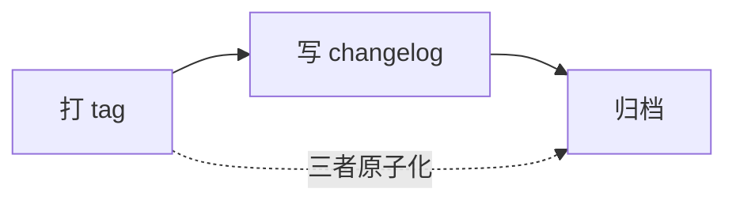

# 3.6 发布与回滚

## 输入

- `iterations/{任务编号}/05-验证报告-{候选commit短hash}.md`（门禁证据来源）
- 验证过的候选 commit（tag 指向它）
- 上一版本 tag（回滚点）

## 发布门禁八条

全部通过才可发布：

1. 当前失败已进入回归集并通过
2. 原有关键断言没有退化
3. 结构不变量全部通过
4. 共享调用方没有出现新问题
5. 验证集表现没有下降
6. 执行轨迹中没有未解释的临时补丁或绕过行为
7. 人工反馈无未解决问题
8. 上一版本仍然可以回滚

逐条对照留痕于 changelog 条目，每条指向 05-验证报告的证据。

## 活动顺序（三者原子化）

要么全部完成，要么全部不生效。git 没有跨 tag 与 commit 的原子操作：tag 已打而 changelog 写入失败时，删掉刚打的 tag 整体重来——changelog 缺条目即该版本未发布。

### 1. 打 tag

候选转正式版本，旧版自动转为回滚点。tag 指向**验证过的候选 commit**——与 05 验证报告记录的 hash 一致，验证对象 = 发布对象。

版本命名 `v{major}.{minor}`：结构性/接口变更升 major，行为与文案变更升 minor（对应 P1/P2）；P3 表述调整不升版本号——此时不打新 tag，changelog 在当前版本条目下追加带日期的调整记录小节（`### YYYY-MM-DD P3 调整`），不新建版本条目头。只有验证过的版本才有 tag——"只把验证有效的变成正式版本"由 tag 承担，不由 commit 承担。

### 2. 写 changelog

在工件仓库 `CHANGELOG.md` **顶部追加**一条（不新建文件），作为紧随 tag 的独立 commit。**发布时点一次生成**——失败候选不进 changelog，changelog 只记录定稿事实，不是意图。

条目骨架见 `assets/templates/06-changelog模板.md`：版本号、日期、任务编号、修改层级（description / 流程 / 脚本 / schema / 共享组件 / 校验器）、根因摘要、影响的调用方清单、回滚点、验证报告指针、门禁八条对照。

changelog 是版本视角的唯一入口：任务编号 ↔ 版本 ↔ 根因 ↔ 回滚点在此汇合。

### 3. 归档

检查任务目录 01-05 文件齐全、changelog 条目已落盘。归档是检查动作，不产生新文件。

## 回滚（转移动作）

回滚不在活动序列里：它发生在交付之后、沿"生产恶化"边离开发布时执行，直接操作版本库、不依赖流程状态：

1. 确认回滚点存在且可用（门禁第 8 条）
2. 切换 tag 指向回滚点
3. 在 `CHANGELOG.md` 追加回滚条目（回滚至、原因、触发证据指针、后续任务编号）——不删除被回滚版本的条目
4. 带新证据重入 3.1 问题归因（新任务编号），证据详情由新任务的 01-归因问答承载
