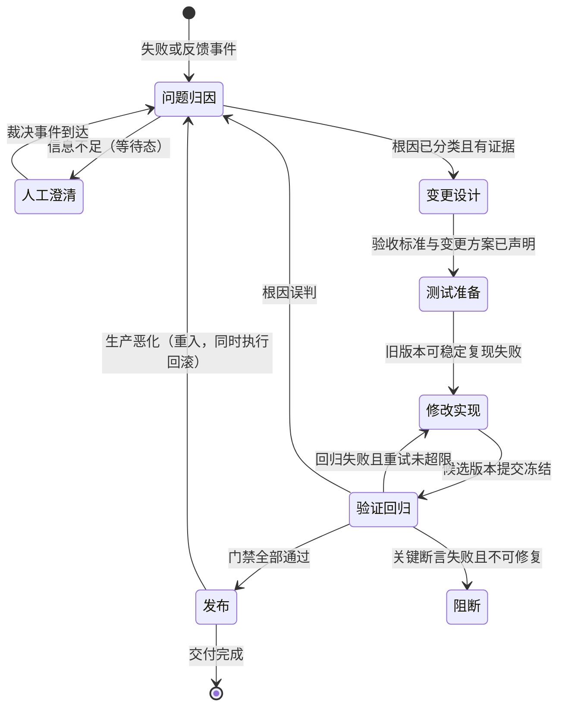
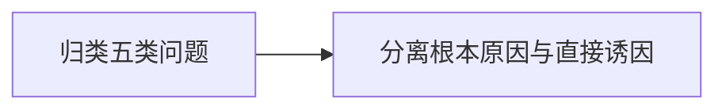
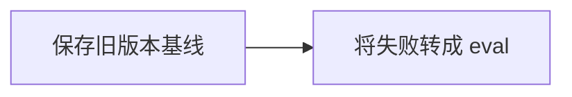
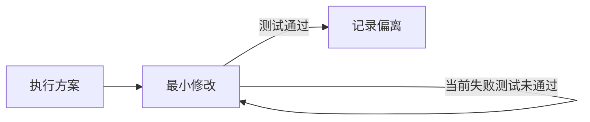
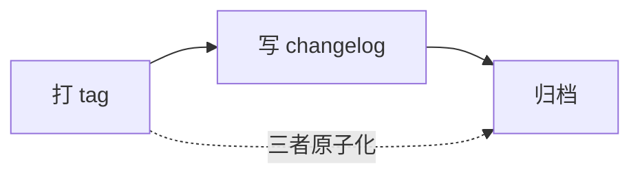

# Agent 迭代指南 v2

## 文档卡片

- 用途：指导 Agent 或同事完成 Agent 或 Skill 的问题定位、修改、测试、发布和复盘，并提供可被调度层执行的状态机模型
- 适用场景：修复生产问题；根据反馈改进 Agent 或 Skill；修改脚本、schema、共享组件或触发条件；发布新版本前回归；将迭代流程编译为调度层编排
- 核心结论：迭代流程建模为事件驱动的流程状态机，回跳边带重试上限；每个状态由 5 元素模板规约（转移规约：触发事件、守卫；行为规约：输入、活动、输出）；守卫统一装载流程证据、工件操作权限与回跳上限三类条件，分自动/半自动/人工三层可判定性；修改前工件只读、修改实现是唯一可写窗口、验证期间工件冻结；按 P1/P2/P3 分级裁剪流程深度
- 关键词：Agent/Skill 迭代、state machine、guard、root cause、baseline、eval、impact analysis、assertion、regression、clean context、release gate
- 关联内容：[[skill撰写指南]]、[[agent_sketch_测试计划]]、[[agent_sketch_设计文档]]、[[agent_sketch_实现文档]]、[[agent_sketch_案例与参考答案规范]]
- 维护状态：草案（待评审）
- 预计阅读时长：13 分钟
- 最后更新：2026-09-15 15:55

> **v2 修订说明**：相比 v1，本文按状态机骨架重组：流程阶段升级为带守卫转移的状态机模型；"修改前/中/后"的时间叙事改为工件操作权限约束；新增变更分级分诊、回跳边与重试上限、版本与回滚操作层、反模式的违规转移映射；附录补齐术语表。v1 的核心内容（五类问题归因、影响面分析、三层裁决分工、防过拟合、干净上下文）全部保留，仅重新安置。本文只保留流程与规范；各状态的输出模板见第 5 章索引，模板实体在 `templates/` 目录。

---

## 1. 定位与阅读路径

### 1.1 分工边界

《skill撰写指南》解决"Skill 应该怎么设计和编写"；本文解决"Agent 或 Skill 投入使用后应该怎么迭代"。本文将被迭代的 Agent 或 Skill 统称为**工件**。

Agent 和 Skill 都不是一次性提示词，而是由说明、脚本、中间模型、工具调用和校验规则共同组成的可运行产品。它会持续面对新输入、边界条件、模型变化、上下游接口变化和生产反馈。

迭代时遵守以下原则：

1. **先定位根因，再修改代码**：区分工件设计、脚本实现、Agent 执行、输入材料和人工裁决问题。
2. **先定义成功，再开始修改**：明确要改变什么、必须保持什么、失败时如何阻断。
3. **先建立可复现失败，再修复**：生产反馈应尽量转化为 eval 或确定性回归测试。
4. **修改范围由根因决定，测试范围由影响面决定**：小改动也可能影响共享调用方。
5. **机械问题交给程序，语义质量交给 grader，业务歧义交给人**。
6. **最终产物正确不等于流程正确**：必须检查执行轨迹、临时补丁和绕过校验的行为。
7. **失败产物不能进入正式交付**：关键断言失败时必须返回非零状态或由调度层阻断。

### 1.2 变更分级分诊

>全档只有一套流程时，小修会被重炮拖垮，执行者学会"灵活变通"后流程逐渐失效。分级分诊在入口就确定流程深度。

进入流程前先分级，每级对应裁剪后的最小深度：

| 级别 | 判定特征 | 典型场景 | 流程深度 |
|---|---|---|---|
| P1 结构性变更 | 改 schema、中间模型、共享组件、校验器、发布门禁 | 重构共享脚本 | 全量闭环：完整归因 + eval + 全部回归 + 全部门禁 |
| P2 局部行为变更 | 改单个工件的流程、脚本逻辑、术语或示例 | 修复结构重复输出 | 裁剪闭环：归因 + 当前失败测试 + 核心回归 + 结构不变量 |
| P3 表述调整 | 改文案、注释、排版，不改任何触发或行为逻辑 | 修正 description 错别字 | 最小闭环：确认无行为影响 + 当前失败测试 + 门禁 |

分级由变更设计阶段（3.2）显式声明，不允许执行中途悄悄升级而不重新分诊。P3 若在验证中发现行为变化，必须升级为 P2 并回到测试准备。

### 1.3 前置成熟度检查

> 状态机化后，守卫的可判定性依赖断言层和 eval 层的成熟度。建模前先检查：
>
> - [ ] 当前失败可以转化为至少一条可执行断言或 eval。
> - [ ] 旧版本输出可以保存并与新版本对比（基线能力）。
> - [ ] 关键校验失败时能够返回非零状态并被调度层识别。
>
> 若 eval 层尚未建立，先建 eval、后建编排——顺序反了会得到一个空转的调度层。守卫的自动化程度可以渐进，但目标状态从一开始就要声明。

---

## 2. 状态机模型总览

### 2.1 流程状态机



> 回跳边各带重试上限：`retry < N`。没有上限的状态机会在"验证失败 → 修改 → 再验证"上死循环；超限后必须升级到人工，这是把"不断追加案例词条"反模式机械化的防呆。

### 2.2 节点元素

第 3 章每个**状态节点**由**转移规约**与**行为规约**两部分描述。
判据：换成另一个业务时，转移规约保留（机器语法，调度层消费和校验），行为规约全部换血（处理内容，人或业务脚本消费）。

#### 2.2.1 转移规约

Transition Specification，每条**边**填一份，随所属状态归档

| 元素   | 含义                                                                             |
| ---- | ------------------------------------------------------------------------------ |
| 触发事件 | 驱动本条转移边的外部事件                                                                   |
| 守卫   | 边上的放行条件，必须可判定。统一装载三类条件：流程证据是否齐备、工件操作权限是否满足（如"未冻结不得进入验证回归"）、回跳次数上限（`retry < N`） |

#### 2.2.2 行为规约

Behavior Specification，每个**状态内**填一份

| 元素 | 含义 |
| --- | --- |
| 输入 | 从共享存储读取的产物 |
| 活动 | 状态内处理流程，复杂时可下沉为子状态机。**节点成功标准在本层定义**（业务口径） |
| 输出 | 写入共享存储的产物，附注落盘位置；成功标准本身也作为输出物产出 |

#### 2.2.3 守卫的边界

守卫必须可判定，否则只是注释。按判定方式分三层：

| 层 | 守卫类型 | 判定者 | 时延 |
|---|---|---|---|
| 自动 | 确定性断言（文件可解析、字段存在、数量唯一、禁止内容为零） | 脚本 | 毫秒级 |
| 半自动 | rubric 初判（完整性、表达、完成度）+ 证据要求 | grader 模型 | 秒级 |
| 人工 | 业务口径、正式名称、法规选择、规则冲突 | 人 | 挂起等待 |

**机械守卫交给调度层，语义守卫交给 grader，裁决守卫留给人**——强行把不可判定的条件写成自动守卫，要么形同虚设，要么把该人工判断的也机械阻断。

**守卫与活动的分工**：节点怎么算成功由业务在活动中定义、作为输出物沉淀，再装载到下一条边的守卫上执行——守卫是插座，成功标准是插头。凡不可机械判定的成功标准不上守卫，留待人工澄清或裁决接住。

**出口守卫**：一条边的守卫，从进入方看是进入守卫，从离开方看就是出口守卫，两者是同一条件。节点小节列出出口守卫，只是把"本状态有哪些出边、各需什么条件"归档在离开方名下，方便按状态查阅。边还可挂**转移动作**（沿边离开时执行的动作，全机仅"发布 → 问题归因"边的回滚一条，见 3.6.3），因不通用，不列为模板元素。

**守卫与结构不变量**：守卫在**转移瞬间**检查；结构不变量是工件性质，约束修改前后的内容结构，横跨多个流程状态，在**验证回归**中检查，声明见 3.2，不进入节点模板。

### 2.3 共享存储

状态机不是无记忆的，产物落在**边之外**的存储里，回滚能力也存在这里。全部存储都在**工件仓库**内——工件自含全部迭代历史，不依赖任何外部存储：

```
工件仓库（自含全部迭代历史）
├── <工件源码>                     git 管理：commit 检查点 / tag 定稿
├── iterations/
│   └── {任务编号}/               01-05 按状态编号留痕
├── evals/                        稳定测试 id
├── results/
│   └── {eval_id}/{version}/      跨版本基线，diff 在相邻目录
└── CHANGELOG.md                  版本视角索引
```

> `iterations/{任务编号}/` 与 `CHANGELOG.md` 之间通过「任务编号 ↔ commit ↔ tag ↔ 根因」双向索引关联（见 3.6）。

| 存储区        | 工具/位置                                              | 命名/规则                                                |
| ---------- | -------------------------------------------------- | ---------------------------------------------------- |
| 版本库        | git（工件源码仓库）                                    | tag `v{major}.{minor}`；候选提交 message 带任务编号与根因编号，作双向索引；`CHANGELOG.md` 为版本视角索引（见 3.6） |
| baseline 库 | `results/{eval_id}/{version}/`                     | 同一输入跨版本对比，diff 在相邻目录                                 |
| eval 集     | `evals/`                                           | 稳定测试 id                                              |
| 迭代日志       | `iterations/{任务编号}/`（工件仓库）                      | 各状态输出按状态编号命名（01-06 对应 3.1-3.6，见第 5 章）                                        |

- 运行轨迹不落盘，它来自执行平台的会话记录，只存在于 Agent 运行平台，作为归因（3.1）与双检查（4.4）的证据来源；
- 基线目前只能存输出，不包含运行轨迹。

---

## 3. 流程状态节点详解

### 3.1 问题归因（工件只读）

#### 3.1.1 转移规约

- **触发事件**：失败或反馈事件（用户反馈、失败产物、执行轨迹）。
- **守卫**：存在可检查的产物或轨迹；工件只读。信息不足则进入人工澄清等待态。
- **出口守卫**：根因已分类且有证据 → 变更设计；裁决事件到达 → 重入归因。

#### 3.1.2 行为规约

- **输入**：用户反馈、失败产物、执行轨迹。
- **输出**：根因分类和证据，写入迭代日志。
- **活动**：按序执行



  1. **归类**：对照五类问题定责

| 问题类型 | 典型表现 | 主要责任层 |
|---|---|---|
| 工件设计问题 | 指令缺失、职责冲突、步骤顺序不合理 | SKILL.md、Agent流程或架构 |
| 脚本实现问题 | 结构被破坏、重复输出、校验失效 | 确定性脚本或共享组件 |
| Agent 执行问题 | 跳过步骤、误读报告、临时修补产物 | 执行约束、轨迹审核或提示 |
| 输入材料问题 | 缺失、矛盾、OCR污染、无法确定事实 | 材料治理和异常状态 |
| 人工裁决缺失 | 多个候选都合理但无法自动确定 | 人机交互和暂停条件 |

  2. **分离根因**：同一问题可能含两层原因（工件设计先破坏结构，Agent 又用临时补丁造成重复），分别记录**根本原因**（为什么进入错误状态）和**直接诱因**（为什么本次表现为当前错误）。不要只根据最终现象修改最后一个处理节点。

### 3.2 变更设计（工件只读）

#### 3.2.1 转移规约

- **触发事件**：归因完成。
- **守卫**：根因已分类且有证据；工件只读。
- **出口守卫**：验收标准（成功标准、结构不变量、影响面、变更分级）与变更方案已声明 → 测试准备。

#### 3.2.2 行为规约

- **输入**：根因、需求、现有实现。
- **输出**：两份文件，写入迭代日志——**验收标准**（成功标准、结构不变量、影响面、变更分级，供测试准备消费）与**变更方案**（意图层修改方案与触及清单，供修改实现消费）。验证方只拿验收标准，不接触变更方案，避免被实现意图带偏。
- **活动**：按序执行


  1. **定义成功标准**：回答五个问题——哪个行为必须改变？哪些已有能力必须保持？哪些结果可由脚本判断？哪些需要模型或人工判断？哪些失败必须阻断交付？标准**按需**覆盖以下维度（结果必选，其余视工件性质与证据可得性选填），每条标注判定方式：脚本可判、需人工、需平台侧——过程类标准依赖执行轨迹，工作区通常无法判定，仅在平台侧可查时声明：

| 维度 | 需要回答的问题 | 示例 |
|---|---|---|
| 结果 | 最终输出是否正确 | 文件可打开、字段完整、内容有依据 |
| 过程 | 是否采用允许的路径 | 未读取禁用材料、未直接修改历史结果 |
| 结构 | 接口和文档结构是否保持 | schema、字段、链接、书签和层级未破坏 |
| 效率 | 成本是否可接受 | token、时长、重试和人工介入合理 |

  2. **声明结构不变量**（修改前后都必须成立）：必需字段存在，类型和层级不变；记录、表格或章节没有无故增减；标识符唯一，引用目标存在；超链接显示文本、目标书签和正文文本一致；同一内容不因多个表示层重复输出；错误输入和校验失败不进入正式交付。涉及 DOCX、HTML、XML 或富文本时，不能只比较可见文本，还要检查 run、field、hyperlink、bookmark、merge 等结构表示。结构不变量是工件性质，横跨多个流程状态，在验证回归中检查，不进入节点模板（见 2.2 的检查元素区分）。

  3. **制定变更方案**（意图层）：针对根因确定改哪一层、修改思路及理由，落成触及清单（文件、小节、函数级坐标）。方案只到意图层，伪代码级实现决策留给修改实现。触及清单即改动边界：修改实现的 diff 越出清单，即为偏离信号。选层参考：

| 问题 | 优先修改位置 |
|---|---|
| 工件未触发或误触发 | description |
| Agent不知道先后顺序或暂停条件 | SKILL.md、Agent流程 |
| 固定结构、格式、排序或校验错误 | 脚本 |
| 上下游字段定义不一致 | schema或中间模型 |
| 动态语义无法确定 | AI提取规则或人工裁决接口 |
| 多个工件同时出现同类问题 | 共享组件及其接口契约 |

  不要用提示词约束替代本应由程序保证的机械结构，也不要用脚本硬编码本应由材料、AI 或人工决定的业务事实。
  4. **分析依赖和影响面**（依赖变更方案）：画出处理链（输入 → 解析/抽取 → 中间模型 → 内容生成 → 格式处理 → 校验 → 交付），对被修改节点逐项询问：谁提供输入？谁消费输出？是否被多个工件共用？是否改变 schema、文件结构或执行顺序？下游是否会再次处理同一段内容？出错后补救会不会与原逻辑叠加？

| 变更类型 | 主要影响 | 必须增加的测试 |
|---|---|---|
| description | 触发和误触发 | 正例、改写正例、负例 |
| SKILL.md流程 | 决策顺序和工具选择 | 功能测试、轨迹检查 |
| 术语或示例 | 文本生成和过拟合 | 新旧术语、未见样本、验证集 |
| scripts | 确定性输出和文件结构 | 单元测试、结构断言 |
| 中间模型/schema | 上下游接口 | 契约测试、端到端测试 |
| 共享组件 | 所有调用方 | 调用方清单、跨工件回归 |
| 校验器 | 发布门禁 | 正确结果通过、错误结果阻断 |

  5. **声明变更分级**：本阶段同时完成 **1.2 的分级声明**。测试范围由依赖链和调用方决定，而不是由修改代码的行数决定。

### 3.3 测试准备（工件只读）

#### 3.3.1 转移规约

- **触发事件**：变更设计完成。
- **守卫**：成功标准、结构不变量、影响面已声明；工件只读。
- **出口守卫**：旧版本可稳定复现失败 → 修改实现。

#### 3.3.2 行为规约

- **输入**：失败样本、旧版本。
- **输出**：eval 与测试输入（写入 eval 集）、baseline（写入 baseline 库）、测试准备记录（脱敏对照与 eval 索引，写入迭代日志）。
- **活动**：按序执行



  1. **保存旧版本基线**：修改前的工件版本（Git 提交或快照）；相同测试输入下的旧输出；断言和人工审核结果；token、运行时长等指标（运行轨迹留在平台，不入基线）。没有基线，只能证明新版本能运行，无法证明它比旧版本更好，也无法发现修复一处却破坏另一处。
  2. **将失败转成 eval**：

     ```json
     {
       "id": "stable-test-id",
       "task": "T-001",
       "criteria": ["S1", "I2"],
       "prompt": "真实但去业务化的用户请求",
       "expected_output": "人可理解的成功标准",
       "files": ["evals/files/input.ext"],
       "assertions": [
         "输出文件可打开",
         "关键字段仅出现一次",
         "禁止内容不存在"
       ]
     }
     ```

     测试资产保留触发问题所需的结构特征，但删除真实公司名、批号、项目名、业务结论和参考答案内容。`task` 与 `criteria` 字段建立 eval 与任务、验收标准的双向溯源。

     > 保留问题结构，不保留案例答案。断言最终必须落实为可执行检查（脚本断言或 grader rubric），否则只是看起来像测试的注释。

### 3.4 修改实现（工件可写）

#### 3.4.1 转移规约

- **触发事件**：测试准备完成。
- **守卫**：旧版本可稳定复现失败；工件可写（唯一可写窗口）。
- **出口守卫**：提交候选、工件冻结 → 验证回归。提交后修改窗口关闭。

#### 3.4.2 行为规约

- **输入**：设计结论、基线、eval。
- **输出**：候选版本（写入版本库，commit message 带 [任务编号]）+ 变更记录（版本指针、自检结果、偏离记录，写入迭代日志）。操作纪律（一次只修一个根因、不混入无关变更）见活动"最小修改"。
- **活动**：子状态机，按序执行



  1. **执行方案**：按 02-变更方案 直接实施，不重新推演影响面、不重新选层。越出触及清单或方案不可行时，不擅自改方案，如实记入偏离记录。

  2. **最小修改**：小步修改，一次只解决一个根因；不顺便清理无关代码或增加未经确认的业务规则；先运行当前失败测试，再扩大回归范围；临时修复最终产物只能用于紧急交付，不能代替对工件的正式修复。

  3. **记录偏离**：变更记录只记三样——候选版本指针、自检退出状态、偏离（方案不可行、越出触及清单、临时补救、人工裁决及依据）。"改了什么"由 diff 承载，"为什么改"由变更方案承载，"改得对不对"由验证回归承载。

### 3.5 验证回归（工件冻结）

#### 3.5.1 转移规约

- **触发事件**：候选版本提交冻结。
- **守卫**：候选版本冻结，不得修改；eval 在干净上下文中运行（见 4.2）。
- **出口守卫**（三类出口）：
  - 前进：门禁全部通过 → 发布。
  - 回跳：回归失败且 `retry < N` → 修改实现（工件解冻）；根因误判 → 问题归因。
  - 阻断：关键断言失败且不可修复 → 阻断终止。

#### 3.5.2 行为规约

- **输入**：新旧版本、测试集、成功标准、影响面结论。
- **输出**：验证报告（回归范围、逐项结果、人工裁决记录、出口结论，写入迭代日志）；新版本输出按既有约定落 baseline 库 `results/{eval_id}/{候选版本}/`（运行轨迹留在平台）。
- **活动**：按序执行


  1. **确定回归范围**：按 1.2 的分级和 3.2 的影响面结论，查分层回归表定最低范围

| 修改范围 | 最低回归范围 |
|---|---|
| 文档或局部提示调整 | 当前失败测试、核心功能测试 |
| 单个工件脚本 | 当前失败、核心测试、结构不变量、端到端流程 |
| schema 或输入输出接口 | 上游契约、下游契约、端到端流程 |
| 共享脚本或组件 | 全部已知调用方、端到端流程、验证集 |
| 触发 description | Triggering 正例、改写正例、负例和相邻工件 |
| 发布门禁或校验器 | 正确样本通过、错误样本阻断、调度层停止交付 |

  2. **执行三类测试**：

  - *Triggering tests*（验证工件是否在正确时间加载）：明确请求、口语化改写和隐含请求能够触发；无关请求不会触发；相邻工件不会互相抢占。只有 description 或触发边界变化时才需重点扩大。
  - *Functional tests*（验证实际任务能力）：正常、缺失、异常和边界输入；用户必须参与裁决的情况；工具失败、重试和中断路径；文件结构、schema 和业务规则。
  - *Performance comparison*（判断新版本是否值得发布）：任务成功率和断言通过率；用户纠正和人工介入次数；工具失败和重试次数；token 消耗和运行时长。显著性阈值由业务方约定，本文不设统一数值。

  3. **按顺序运行**：当前失败测试 → 当前工件核心测试集 → 受影响调用方测试 → 端到端流程测试 → 独立验证集。验证期间候选版本不得再修改——边测边改，对比的就是移动靶，基线比较在方法学上直接失效；需要改即走回跳边解冻重做，违反冻结即第 6 章反模式。

### 3.6 发布与回滚（工件标记）

#### 3.6.1 转移规约

- **触发事件**：验证回归全部通过。
- **守卫**：发布门禁八条全过——
  1. 当前失败已进入回归集并通过。
  2. 原有关键断言没有退化。
  3. 结构不变量全部通过。
  4. 共享调用方没有出现新问题。
  5. 验证集表现没有下降。
  6. 执行轨迹中没有未解释的临时补丁或绕过行为。
  7. 人工反馈无未解决问题。
  8. 上一版本仍然可以回滚。
- **出口守卫**：交付完成 → 终止；生产恶化或验证集退化 → **回滚 + 重入问题归因**。

#### 3.6.2 行为规约

- **输入**：全部验收结果。
- **输出**：新版本（tag）、changelog 条目、回滚点，写入版本库。tag 指向验证过的候选 commit；changelog 为工件仓库 `CHANGELOG.md` 的追加条目（含门禁八条对照）；归档为检查动作（任务目录 01-05 齐全）。
- **活动**：按序执行



  1. **打 tag**：候选转正式版本，旧版自动转为回滚点。tag 指向验证过的候选 commit——与 05 验证报告记录的 hash 一致，验证对象 = 发布对象。
     > 版本命名建议 `v{major}.{minor}`——结构性/接口变更升 major，行为与文案变更升 minor；与 1.2 的 P1/P2 分级对应，P3 表述调整默认不升版本号。
  2. **写 changelog**：在工件仓库 `CHANGELOG.md` 追加一条，作为紧随 tag 的独立 commit，**发布时点一次生成**——失败候选不进 changelog，changelog 只记录定稿事实。字段：版本号、日期、任务编号、修改层级（description / 流程 / 脚本 / schema / 共享组件 / 校验器）、对应根因编号、影响的调用方清单、回滚点位置、门禁八条对照（每条指向 05 验证报告的证据）。changelog 是版本视角的唯一入口：任务编号 ↔ 版本 ↔ 根因 ↔ 回滚点在此汇合。
  3. **归档**：检查任务目录 01-05 文件齐全、changelog 条目已落盘。归档是检查动作，不产生新文件。tag、changelog、归档三者原子化，要么全部完成，要么全部不生效。

#### 3.6.3 回滚（转移动作）

回滚不在活动的 1-2-3 序列里：活动是状态内的行为，回滚发生在交付之后、沿"生产恶化"边离开发布时执行，是本机唯一的一条转移动作，直接操作版本库、不依赖流程状态：

1. 确认回滚点存在且可用（门禁第 8 条）。
2. 切换 tag 指向回滚点。
3. 在 `CHANGELOG.md` 追加回滚条目（回滚原因、触发证据的指针）；证据详情由重入归因的新任务 01-归因问答承载。
4. 带新证据重入问题归因。

---

## 4. 横切规范

以下规范作用于多个状态，不归属任何单章，各状态按需引用。

### 4.1 三层裁决分工

| 方式 | 适合判断 | 不适合判断 |
|---|---|---|
| 确定性断言 | 文件、字段、数量、链接、重复、禁止字符 | 专业语义和业务口径 |
| Rubric grader | 完整性、专业表达、论证和任务完成度 | 唯一正式名称和冲突裁决 |
| 人工审核 | 业务口径、正式名称、法规选择和规则冲突 | 大量重复机械检查 |

关键机械问题必须由脚本断言：输出文件可解析；必需字段和引用目标存在；同一表号不重复输出；超链接显示文本非空且仅出现一次；中文残留、敏感信息或禁止内容为零；校验失败时命令返回非零状态。grader 必须给出具体证据，不能只写"通过"或"看起来正确"。

### 4.2 干净上下文

开发对话通常已包含正确答案、临时路径、调试结论和人工裁决。在同一对话中测试，Agent 可能依赖这些额外信息而不是依赖工件。因此：

- 每个正式 eval 使用新会话或隔离子任务。
- 只提供正式运行时真实可获得的输入。
- 不提供参考答案或开发阶段讨论。
- 实现者可以自检，但出口判定必须由非实现者执行——自检是快速失败闸，不是验证。
- 不共享前一次运行的临时记忆和补丁。

### 4.3 防迭代过拟合

将查询分为**训练集**（允许用于分析失败和修改工件）与**验证集**（不参与修改，只检查是否能够泛化）。

避免：把真实失败句子直接加入通用词典；为单个文件名、批号或公司名增加专用分支；每次只重跑同一个案例；因为当前案例通过就宣布通用问题已解决。

应提炼通用结构（如"多个文本节点表达同一内容""共享脚本重复处理同一引用"），再使用业务值不同的样本验证。

### 4.4 产物与轨迹双检查

最终产物说明"发生了什么"，执行轨迹说明"为什么发生"。需要检查：是否读取了错误材料；是否跳过关键校验；是否先产生错误结果再用运行时补丁掩盖；是否修改最终产物而没有修复工件；是否依赖开发对话中的答案。

### 4.5 失败必须阻断交付

校验器不能只写报告。关键检查失败时应同时——保存失败产物和定位报告；返回非零状态或明确失败状态；调度层禁止复制到正式交付目录；修正工件、脚本或人工输入后重新运行。不要让 Agent 自行修改运行产物来绕过校验。

### 4.6 git 使用规范

commit 与 tag 分工：**commit 是检查点，tag 是定稿**。

- **提交时机**：3.4 出口——自检通过后、送独立验证前。候选必须以 commit 为冻结实体（工作区冻不住，hash 才不可变），且验证对象 = 提交对象，零缝隙。
- **commit message**：`[T-001] 摘要`，与迭代日志双向索引（见 2.3）。
- **tag**：3.6 门禁全过后打，`v{major}.{minor}`（命名见 3.6）。只有验证过的版本才有 tag——"只把验证有效的变成正式版本"由 tag 承担，不由 commit 承担。
- **失败候选**：留在历史中，是重试证据；介意主线干净可用任务分支，3.6 时合并回主线。
- **回滚点**：上一版本的 tag。

---

## 5. 模板库

模板实体存于 `templates/` 目录，与本文档同库维护。**编号即状态**：01-06 对应 3.1-3.6；任务目录里按编号落盘的文件本身就是进度——01 到 05 齐全说明走到验证，缺哪个就知道停在哪。

| 模板 | 产出状态 | 落盘位置 | 消费方 |
|---|---|---|---|
| 01-归因提问模板 | 3.1 | 静态模板，填槽后贴到平台提问 | 平台原始 Agent |
| 01-归因问答记录模板 | 3.1 | `iterations/T-xxx/01-归因问答.md` | 3.2（根因输入）、复核 |
| 02-验收标准模板 | 3.2 | `iterations/T-xxx/02-验收标准.md` | 3.3（转 eval）、3.5（验证判定） |
| 02-变更方案模板 | 3.2 | `iterations/T-xxx/02-变更方案.md` | 3.4（执行依据） |
| 03-测试准备模板 | 3.3 | `iterations/T-xxx/03-测试准备.md` | 脱敏对照与 eval 索引 |
| 03-eval模板 | 3.3 | `evals/{eval-id}.json` | 3.4 自检、3.5 验证 |
| 04-变更记录模板 | 3.4 | `iterations/T-xxx/04-变更记录.md` | 回跳后的修改实现、审计 |
| 05-验证报告模板 | 3.5 | `iterations/T-xxx/05-验证报告-{hash}.md` | 3.6 门禁对照、审计 |
| 06-changelog模板 | 3.6 | 工件仓库 `CHANGELOG.md`（条目追加） | 维护者（版本视角入口）、回滚 |

模板承载填写结构与硬约束（怎么填），思考过程在第三章各状态（怎么想）——两处不重复维护。每份模板头部标注使用方式、消费方与职责边界。

---

## 6. 反模式与违规转移映射

每个反模式对应状态机上的一条非法转移。这张表是文档规范走向运行时校验的接口——调度层将来可据此做转移合法性检查。

| 反模式 | 非法转移 | 正确做法 |
|---|---|---|
| 只测试当前修复点 | 跳过受影响调用方测试直达发布 | 按依赖链确定回归范围 |
| 直接修改最终产物 | `验证回归 → 发布` 绕过守卫 | 修复工件并增加回归测试 |
| 边分析边改 | 归因/设计期间工件被写（违反工件只读） | 工件只读，分析基于当前已发布版本 |
| 边测边改 | 验证回归期间候选被修改（违反工件冻结） | 走回跳边解冻后重走验证 |
| 不断追加案例词条 | `验证回归 → 修改实现` 无重试上限 | 超限升级人工，提炼通用结构 |
| 只看最终结果 | 忽略轨迹检查的转移 | 同时检查产物和执行轨迹 |
| 校验器只报告 | 阻断出口缺失 | 返回失败并在调度层阻断 |
| 在开发对话中测试 | 干净上下文守卫缺失 | 使用新会话或隔离 eval |
| 共享组件只测一个调用方 | 调用方回归缺失 | 回归全部已知调用方 |
| 运行时临时补链接或文本 | 绕过修改实现直接改产物 | 修复结构处理接口并重跑 |
| 发布后再补 changelog | tag 与记录非原子 | 发布动作原子化，三者同生同灭 |

---

## 7. 附录

### 7.1 术语表

| 术语        | 英文                       | 含义                                             |
| --------- | ------------------------ | ---------------------------------------------- |
| 工件        | agent \| skill           | 被迭代的对象，例如skill或者agent                          |
| 转移规约      | transition specification | 对一条转移边的规约，含触发事件与守卫，独立于业务，调度层消费和校验              |
| 行为规约      | behavior specification   | 对一个状态的行为规约，含输入、活动、输出，承载业务处理内容                  |
| 守卫        | guard                    | 状态转移边上的可判定条件，统一装载流程证据、工件操作权限与回跳上限，分自动/半自动/人工三层 |
| 转移动作      | transition action        | 沿转移边离开时执行的动作，全机仅"发布 → 问题归因"边的回滚一条，不列为模板元素          |
| 候选版本      | candidate                | 已提交待验证的版本，验证期间冻结                               |
| 回滚点       | rollback point           | 上一正式版本的 tag，回滚操作的目标                            |
| 基线        | baseline                 | 旧版本快照及其在相同输入下的输出，用于对比                          |
| 运行轨迹      | run trace                | 被迭代对象每次执行的记录（读了什么材料、调了什么工具、产出什么），保留在执行平台会话中，不落盘   |
| 迭代日志      | iteration log            | 迭代流程自身的执行记录（各状态输出、守卫判定、重试、人工裁决），按任务编号归档于 `iterations/` |
| 验收标准      | acceptance criteria     | 3.2 产出：成功标准、结构不变量、影响面、变更分级的集合，供测试准备转 eval、验证方判定；验证方不读变更方案 |
| 变更方案      | change plan             | 3.2 产出的意图层修改方案与触及清单，供修改实现直接执行 |
| 触及清单      | touch list              | 变更方案中列出的改动位置坐标，作为修改实现的 diff 边界，越出即偏离信号 |
| 偏离记录      | deviation record        | 修改实现与变更方案不符时的留痕（方案不可行、越出触及清单、临时补救、人工裁决），记于 04-变更记录 |
| 发布门禁      | release gate            | 3.6 发布前必须全过的八条检查，逐条对照留痕于 changelog 条目 |
| 评测        | eval                     | 将失败转化来的可重复测试，含输入、预期和断言                         |
| 断言        | assertion                | 确定性脚本检查，失败返回非零状态                               |
| 结构不变量     | structural invariant     | 工件在修改前后必须保持的内容结构约束，横跨流程状态，在验证回归中检查             |
| 评分器       | grader                   | 按评分标准对语义质量初判并给出证据的模型                           |
| 训练集 / 验证集 | train / validation set   | 允许参与修改的样本 / 只检查泛化的样本                           |
| 干净上下文     | clean context            | 不含开发期隐性知识的全新会话环境                               |
| 触发测试      | triggering test          | 验证工件在正确时间加载的测试                            |
| 分级分诊      | triage                   | 按变更结构影响将流程深度裁剪为 P1/P2/P3                       |
| 阻断        | block                    | 关键守卫失败时终止交付的终止态                                |

### 7.2 权威来源

本文以官方测试和评测方法为主干，通用工程化推论以 `>` 标记。

| 来源 | 链接 | 主要内容 |
|---|---|---|
| Agent Skills：Evaluating skill output quality | https://agentskills.io/skill-creation/evaluating-skills | 测试集、旧版本基线、断言、评分、人工审核和迭代闭环 |
| Agent Skills：Optimizing skill descriptions | https://agentskills.io/skill-creation/optimizing-descriptions | 训练集、验证集、避免过拟合和 description 优化 |
| Anthropic：The Complete Guide to Building Skills for Claude | https://resources.anthropic.com/hubfs/The-Complete-Guide-to-Building-Skill-for-Claude.pdf | Triggering、Functional 和 Performance 测试 |
| Anthropic：Demystifying evals for AI agents | https://www.anthropic.com/engineering/demystifying-evals-for-ai-agents | Agent eval 设计、生产反馈和实验方法 |
| OpenAI：Testing Agent Skills systematically with evaluations | https://developers.openai.com/blog/eval-skills | 隔离运行、执行轨迹、产物、grader 和版本评分 |
| OpenAI：Evaluation best practices | https://developers.openai.com/api/docs/guides/evaluation-best-practices | 尽早评测、任务化设计、自动化和持续评测 |

### 7.3 `>` 标记约定

正文凡属于通用工程化推论（非官方来源直接支持）的内容，均以引用块 `> ` 标记，当前包括：1.2 分级分诊、1.3 前置成熟度、2.1 重试上限、3.3 断言落实要求、3.6 版本命名；2.3 存储布局在引导句中注明。3.2-3.6 的文件拆分设计（验收标准与变更方案、触及清单、偏离记录、changelog 条目）、4.6 git 使用规范与第 5 章模板索引同为本文的工程化设计，不逐段标记。未标记处为官方方法或其直接重述。

---

Agent 或 Skill 的迭代不是"根据反馈增加一条规则"，而是"定位根因、定义成功、建立基线和 eval、分析影响面、做最小修改、完成分层回归，并用发布门禁证明新版本没有破坏旧能力"——v2 进一步把这句话从文档规范升级为可被调度层执行的状态机。
